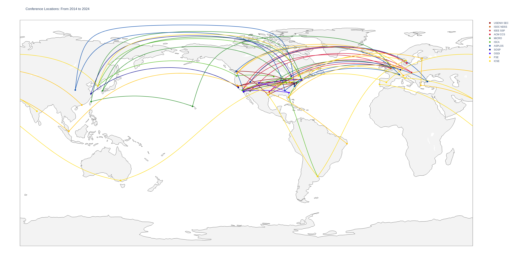

# Top Tier Systems Conferences and Their Locations

Wondering about the US bias of our top tier conferences, my goal was to
visualize the actual state of affairs. A couple of hours of plotly coding later,
I managed to create a nice visual map of the top tier conferences over the last
10 years.

Software engineering is the most inclusive as it moves a lot and spreads
geographically. Systems and architecture tries and moves somewhat. Security is
abysmal, only one of the top 4 conferences moves, the others remain put or
mostly put.

Adjust the code at will, it requires plotly and geopy:
```
apt install python3-plotly python3-geopy
```
You also need numpy and a couple of other basic packages that should be
installed if you ever ran Python on your system.

If you want to check out the visual map, check out
[my website](https://nebelwelt.net/gannimo/conf_locs.html) or have a look at the
static image below:


